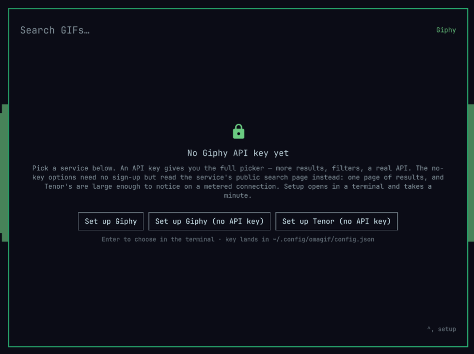

# Omagif

A GIF picker for the [Omarchy](https://omarchy.org/) shell. Hit a key, type a
search, arrow around an animated grid, press Enter — the GIF is on your
clipboard, ready to paste into Slack, Discord, Signal, or anywhere else that
takes an image.


## Requirements

- Omarchy 4.x
- `curl`, `wl-clipboard`, `wtype`, `python3` — all present on a stock Omarchy
- Optionally a free [Giphy API key](https://developers.giphy.com/dashboard/);
  there are also [no-key options](#which-provider)

## Install

```bash
omarchy plugin add https://github.com/stoneynutcase/omagif --enable
```

That's the whole install. The first time you open the picker it shows a
**Set up** button per available service, which opens setup in a floating
terminal.



You can run it yourself too:

```bash
omagif setup                          # asks which service
omagif setup --provider giphy-keyless # no key at all
```

Setup checks dependencies, helps you get a key if you want one, writes
`~/.config/omagif/config.json`, and offers to link the `omagif` command and add
a keybinding. Nothing is assumed — it asks. Run it again any time to change
service or key, or press `Ctrl+,` inside the picker.

### Which provider?

Four to choose from. `setup` offers the ones you can actually use, and `Ctrl+P`
swaps between whatever you have set up — so you can run two no-key providers
side by side and never register for anything.

| Provider | Key | Pros | Cons |
|---|---|---|---|
| **Giphy** | free sign-up | 40 results, scroll for more; `rating` and `lang` filters; a stable API behind it | you have to register for a key |
| **Giphy (no API key)** | none | works instantly; light — under 1 MB a search | ~25 results, no second page; no filters; breaks if Giphy changes its page |
| **Tenor (no API key)** | none | works instantly; most results (~49); the only way to use Tenor now | heavy — 15-20 MB a search; no filters; breaks if Tenor changes its page |
| **Tenor** | closed | full API: 40 results, scroll, content filter | Google stopped issuing keys in January 2026 — offered only if you already hold one |

**If you just want it working now**, pick *Giphy (no API key)*. **If you use it
daily**, get the free Giphy key — filters and endless scrolling are worth the
minute it takes. **Tenor (no API key)** returns the most results and is the only
route to Tenor since Google closed sign-ups, but it is the data-hungry one:
Tenor serves much larger GIFs, so one search pulls 15-20 MB of previews and a
copied GIF can be 10-20 MB. Worth knowing on a metered or slow connection —
`setup` says so before you pick it.

The no-key providers read each service's public search page instead of its API.
That is what buys you the instant start, and what costs you the filters, the
second page, and the guarantee: if a service redesigns that page, its provider
starts reporting no results. The picker says so plainly, and `Ctrl+P` moves you
to another provider.

## Keys

| Key | Action |
| --- | --- |
| type | search (empty search shows what's trending) |
| `Tab` | select the whole query — type to replace it, or `Delete` to clear it |
| `Ctrl+Up` / `Ctrl+Down` | walk back and forward through past searches |
| `Ctrl+Delete` | forget every remembered search |
| `←` `→` `↑` `↓` | move around the grid |
| `PgUp` `PgDn` `Home` `End` | move by a screenful, or jump to either end |
| `Enter` | copy the GIF as a **file** (see below) |
| `Shift+Enter` | copy the GIF's share link as text |
| `Ctrl+Enter` | paste that link straight into the window underneath |
| `Alt+Enter` | copy the GIF's raw bytes as `image/gif` |
| `Ctrl+S` | save the GIF to `~/Pictures/gifs` |
| `Ctrl+O` | open the GIF's page in your browser |
| `Ctrl+P` | switch provider — remembered until you change service in setup |
| `Ctrl+,` | reopen setup to change service or key |
| `Backspace` | delete a character |
| `Esc` | close the picker |

Left-click does the `Enter` action, middle-click copies the link, right-click
opens the page.

Your search is never cleared behind your back: `Esc` closes the picker and
leaves the query alone, so it is still there next time. The one thing that
empties it is `Tab` then `Delete`.

`Ctrl+P` sticks too. The provider you swap to is remembered across restarts,
and stays until you pick a service in `omagif setup` — that is an explicit
choice, so it wins.

### What Enter copies

The clipboard holds exactly one payload, so the choice matters:

| Payload | Reality |
| --- | --- |
| **File** (`Enter`) | the receiving app attaches the actual GIF, animation intact. The default |
| **Link** (`Shift+Enter`) | depends on the far end unfurling the URL; some preview fetchers refuse |
| **GIF** (`Alt+Enter`) | rarely pastes at all — apps ask the clipboard for `image/png` |

That last row looks like a bug but isn't: `image/gif` is not part of the
desktop's image convention, and converting to PNG would throw away the
animation. The file is copied under a readable name from the GIF's title
(`suspicious-monkey.gif`).

Change the default with `enterAction` — `"file"`, `"link"`, `"paste"`, or
`"image"`. The modifier variants keep working regardless.

`linkStyle` picks what a copied link points at: `page` (default) is the
`giphy.com/gifs/…` share link that chat apps unfurl into a playing GIF;
`direct` is a short `i.giphy.com/<id>.gif` that renders inline in Discord and
Slack.

## Configuration

`~/.config/omagif/config.json`, hot-reloaded on save:

```json
{
  "provider": "giphy",
  "giphy": { "apiKey": "…", "rating": "pg-13", "lang": "en" },
  "limit": 40,
  "columns": 4,
  "saveDir": "~/Pictures/gifs"
}
```

| Key | Meaning |
| --- | --- |
| `provider` | which service to search: `giphy`, `giphy-keyless`, `tenor-keyless` |
| `<provider>.apiKey` | your key; the picker says so plainly when it's missing |
| `giphy.rating` | `g`, `pg`, `pg-13`, `r` |
| `enterAction` | what `Enter` and left-click do: `file`, `link`, `paste`, `image` |
| `linkStyle` | `page` for the share link, `direct` for a short `.gif` URL |
| `historyLimit` | searches to remember (default 50; `0` records none) |
| `pasteKey` | auto-paste keystroke: `ctrl+v`, `shift+insert`, `ctrl+shift+v` |
| `pasteDelayMs` | wait before that keystroke (default 300) |
| `limit` | results per page, capped at 50 |
| `columns` | grid columns, 2–8 |
| `cacheDir` | where downloaded GIFs are kept |
| `saveDir` | where `Ctrl+S` puts GIFs |

The file lives here rather than in `~/.config/omarchy/shell.json` because that
one is mode 644, gets pasted into bug reports and rewritten by
`omarchy refresh shell` — no place for an API key. This one is mode 600.

`omagif doctor` checks your dependencies, config, and whether the shell has
found the plugin.

### Search history

Searches are remembered most-recent-first; `Ctrl+Up` and `Ctrl+Down` walk
through them. A query is recorded when the picker **closes**, not on every
keystroke, and searches that found nothing aren't kept.

```bash
omagif history          # list what's remembered
omagif history clear    # forget all of it
```

Set `historyLimit` to `0` to record nothing.

### When auto-paste doesn't land

`Ctrl+Enter` copies the link, then synthesises a keystroke. Two things can go
wrong, both tunable:

- **Focus timing** — the compositor hands focus back asynchronously, so a
  keystroke sent too early lands nowhere. Raise `pasteDelayMs`.
- **The keystroke** — `ctrl+v` suits Electron and GTK apps; a terminal wants
  `ctrl+shift+v`.

The link stays on your clipboard either way, so a missed paste is one `Ctrl+V`
away. Actions log to `~/.local/state/omagif/omagif.log`.

## Removing it

```bash
omarchy plugin remove stoneynutcase.omagif
```

That takes the plugin directory and nothing else. Everything setup asked
permission to create lives outside it:

```bash
rm -rf ~/.config/omagif                             # config, including your API key
rm -rf ~/.cache/omagif ~/.local/state/omagif        # cached GIFs, history, log, last provider
rm -f  ~/.local/bin/omagif                          # the CLI symlink
rm -f  ~/.local/share/applications/omagif.desktop   # the desktop entry
```

The keybinding is the one thing that isn't a file of ours: `setup` appended it
to `~/.config/hypr/bindings.lua` under an `-- Omagif GIF picker` comment, so
delete that comment and the `o.bind` line under it.

GIFs you saved with `Ctrl+S` stay in `~/Pictures/gifs`. Removing a picker
shouldn't take your pictures with it.

## Contributing

Provider internals, the reload rules, and the test suite are in
[DEVELOPING.md](DEVELOPING.md); the provider contract is in
[`providers/README.md`](providers/README.md).

## License

MIT
