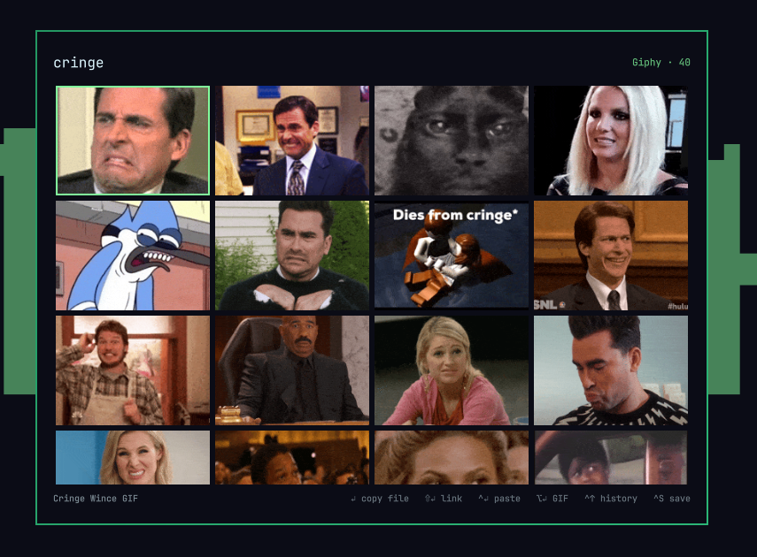

# Omagif

A GIF picker for the [Omarchy](https://omarchy.org/) shell. Hit a key, type a
search, arrow around an animated grid, press Enter — the GIF is on your
clipboard, ready to paste into Slack, Discord, Signal, or anywhere else that
takes an image.



## Requirements

- Omarchy 4.x
- `curl`, `wl-clipboard`, `wtype`, `python3` — all present on a stock Omarchy
- Optionally a free [Giphy API key](https://developers.giphy.com/dashboard/);
  there is also a [no-key option](#searching-without-an-api-key)

## Install

```bash
omarchy plugin add https://github.com/stoneynutcase/omagif --enable
```

That's the whole install. The first time you open the picker it shows a
**Set up** button per available service, which opens setup in a floating
terminal. You can run it yourself too:

```bash
omagif setup                          # asks which service
omagif setup --provider giphy-keyless # no key at all
```

Setup checks dependencies, helps you get a key if you want one, writes
`~/.config/omagif/config.json`, and offers to link the `omagif` command and add
a keybinding. Nothing is assumed — it asks. Run it again any time to change
service or key, or press `Ctrl+,` inside the picker.

### Searching without an API key

Setup offers **Giphy (no API key)** alongside the regular Giphy provider. It
needs no sign-up — pick it and search. It reads Giphy's public search page
instead of the API, which costs you:

| | With a Giphy key | No key |
|---|---|---|
| Results per search | 40, scroll for more | ~25, no second page |
| Rating / language filter | `rating`, `lang` | whatever the page decides |
| Stability | a versioned API | scraped page — a redesign breaks it |

If Giphy ever changes that page, every search starts saying it found nothing.
Adding a key switches you to the full provider; with both set up, `Ctrl+P`
flips between them.

## Keys

| Key | Action |
| --- | --- |
| type | search (empty search shows what's trending) |
| `Tab` | select the whole query, so the next keystroke replaces it |
| `Ctrl+Up` / `Ctrl+Down` | walk back and forward through past searches |
| `Ctrl+Delete` | forget every remembered search |
| `←` `→` `↑` `↓` | move around the grid |
| `PgUp` `PgDn` `Home` `End` | move by a screenful, or jump to either end |
| `Enter` | copy the GIF as a **file** (see below) |
| `Shift+Enter` | copy the GIF's share link as text |
| `Ctrl+Enter` | paste that link straight into the window underneath |
| `Alt+Enter` | copy the GIF's raw bytes as `image/gif` |
| `Ctrl+S` | save the GIF to `~/Pictures/gifs` |
| `Ctrl+O` | open the GIF's page in your browser |
| `Ctrl+P` | switch provider for this session |
| `Ctrl+,` | reopen setup to change service or key |
| `Backspace` / `Ctrl+U` | delete a character / clear the search |
| `Esc` | clear the search, then close |

Left-click does the `Enter` action, middle-click copies the link, right-click
opens the page.

### What Enter copies

The clipboard holds exactly one payload, so the choice matters:

| Payload | Reality |
| --- | --- |
| **File** (`Enter`) | the receiving app attaches the actual GIF, animation intact. The default |
| **Link** (`Shift+Enter`) | depends on the far end unfurling the URL; some preview fetchers refuse |
| **GIF** (`Alt+Enter`) | rarely pastes at all — apps ask the clipboard for `image/png` |

That last row looks like a bug but isn't: `image/gif` is not part of the
desktop's image convention, and converting to PNG would throw away the
animation. The file is copied under a readable name from the GIF's title
(`suspicious-monkey.gif`).

Change the default with `enterAction` — `"file"`, `"link"`, `"paste"`, or
`"image"`. The modifier variants keep working regardless.

`linkStyle` picks what a copied link points at: `page` (default) is the
`giphy.com/gifs/…` share link that chat apps unfurl into a playing GIF;
`direct` is a short `i.giphy.com/<id>.gif` that renders inline in Discord and
Slack.

## Configuration

`~/.config/omagif/config.json`, hot-reloaded on save:

```json
{
  "provider": "giphy",
  "giphy": { "apiKey": "…", "rating": "pg-13", "lang": "en" },
  "limit": 40,
  "columns": 4,
  "saveDir": "~/Pictures/gifs"
}
```

| Key | Meaning |
| --- | --- |
| `provider` | which service to search: `giphy`, `giphy-keyless` |
| `<provider>.apiKey` | your key; the picker says so plainly when it's missing |
| `giphy.rating` | `g`, `pg`, `pg-13`, `r` |
| `enterAction` | what `Enter` and left-click do: `file`, `link`, `paste`, `image` |
| `linkStyle` | `page` for the share link, `direct` for a short `.gif` URL |
| `historyLimit` | searches to remember (default 50; `0` records none) |
| `pasteKey` | auto-paste keystroke: `ctrl+v`, `shift+insert`, `ctrl+shift+v` |
| `pasteDelayMs` | wait before that keystroke (default 300) |
| `limit` | results per page, capped at 50 |
| `columns` | grid columns, 2–8 |
| `cacheDir` | where downloaded GIFs are kept |
| `saveDir` | where `Ctrl+S` puts GIFs |

The file lives here rather than in `~/.config/omarchy/shell.json` because that
one is mode 644, gets pasted into bug reports and rewritten by
`omarchy refresh shell` — no place for an API key. This one is mode 600.

`omagif doctor` checks your dependencies, config, and whether the shell has
found the plugin.

### Search history

Searches are remembered most-recent-first; `Ctrl+Up` and `Ctrl+Down` walk
through them. A query is recorded when the picker **closes**, not on every
keystroke, and searches that found nothing aren't kept.

```bash
omagif history          # list what's remembered
omagif history clear    # forget all of it
```

Set `historyLimit` to `0` to record nothing.

### When auto-paste doesn't land

`Ctrl+Enter` copies the link, then synthesises a keystroke. Two things can go
wrong, both tunable:

- **Focus timing** — the compositor hands focus back asynchronously, so a
  keystroke sent too early lands nowhere. Raise `pasteDelayMs`.
- **The keystroke** — `ctrl+v` suits Electron and GTK apps; a terminal wants
  `ctrl+shift+v`.

The link stays on your clipboard either way, so a missed paste is one `Ctrl+V`
away. Actions log to `~/.local/state/omagif/omagif.log`.

## Removing it

```bash
omarchy plugin remove stoneynutcase.omagif
```

That takes the plugin directory and nothing else. Everything setup asked
permission to create lives outside it:

```bash
rm -rf ~/.config/omagif                             # config, including your API key
rm -rf ~/.cache/omagif ~/.local/state/omagif        # cached GIFs, history, log
rm -f  ~/.local/bin/omagif                          # the CLI symlink
rm -f  ~/.local/share/applications/omagif.desktop   # the desktop entry
```

The keybinding is the one thing that isn't a file of ours: `setup` appended it
to `~/.config/hypr/bindings.lua` under an `-- Omagif GIF picker` comment, so
delete that comment and the `o.bind` line under it.

GIFs you saved with `Ctrl+S` stay in `~/Pictures/gifs`. Removing a picker
shouldn't take your pictures with it.

## Contributing

Provider internals, the reload rules, and the test suite are in
[DEVELOPING.md](DEVELOPING.md); the provider contract is in
[`providers/README.md`](providers/README.md).

## License

MIT
